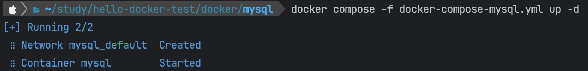

# Hello docker-compose network

## 문제상황?

제대로된 문제 상황인지에 대한지는 잘 모르겠지만 일단 적어본다.

프로젝트를 배포하면서 하나의 서버에서 각기 다른 도커 컴포즈 파일을 사용해서 Spring Boot 서버와 Redis를 올려서 사용하게 되었다.

이 경우에, Spring Boot 서버에서 Redis로 Connection 체크 시 성공은 하지만, 정작 Redis 부분을 사용하는 코드에서 오류가 발생하게 되었다.

각기 다른 도커 컴포즈 파일을 사용하게 되면 디폴트로 각각의 네트워크가 생성된다는 것은 알았지만, 서로 통신하게 되지 못할 줄 몰랐다.

> 이것이 과연 도커 컴포즈에서 자동으로 생성한 docker network 때문이라면, 서버가 올라가기 전 Connection 체크할 때 오류가 발생해야 하는 것 아닌가??

### 어떻게 해결했는가?

먼저 docker compose 내부 파일에서 말고, docker network를 하나 생성해주었다. 그 다음 각 docker compose 파일에서 외부 docker network를 사용하도록 하고, Spring Boot 서버에서 `localhost` 가 아닌 `redis` 를 통해서 통신을 할 수 있도록 호스트 주소를 변경해주었다.

## 상황 재현하기

아래의 저장소를 만들고 테스트를 테스트 해보자.

https://github.com/Lab-pository/hello-docker-compose-network

### Step 1 로컬 데이터베이스를 사용하듯, 설정해주기

- `DB_URL: jdbc:mysql://localhost:3306/docker_test`


먼저 `docker/mysql/docker-compose-mysql.yml` 을 실행한다.


이후 `docker/web/docker-compose-web.yml` 을 실행한다.


다음과 같이 실행이 되지 않는 것을 확인할 수 있다.

### Step 2 같은 도커 네트워크를 사용하는 것 처럼 설정해주기

따로 도커 컴포즈 파일을 실행시켜, 서로 다른 도커 네트워크를 사용하지만 같은 도커 네트워크를 사용하는 것처럼 설정해보자.

- `DB_URL: jdbc:mysql://database:3306/docker_test`


실행이 되지 않는다.

### Step 3 공용 도커 네트워크를 생성해서 이를 사용하도록 하기

먼저 공용으로 같이 사용할 Docker Network를 생성해준다.

```Kotlin
docker network create test-docker-network
```

그리고 각각의 `docker-compose.yml` 파일에 다음과 같이 추가해준다.

```text
version: "3.8"
services:
  ...:
    ...
  networks:
    - test-docker-network
networks:
  test-docker-network:
    external: true
```

어떤 네트워크를 사용할 것이고, 외부 네트워크를 사용하겠다는 설정을 추가해준다.


이후, 각각을 실행시켜준다. 여기서 docker-network 가 생성되지 않음을 알 수 있다.


정상적으로 실행됨을 알 수 있다.

## 회고

도커 네트워크에 대한 이해가 높았다면 더 쉽게 해결할 수 있지 않았을까? 라는 생각을 하게 되었다. 실제 업무에서 도커를 사용하는 경우에는 네트워크 구성이 어떻게 되는지도 궁금해지게 되었다.

### 참고 자료

- https://itbhome.tistory.com/47
- https://docs.docker.com/engine/reference/commandline/network_create
- https://pinggoopark.tistory.com/550
- https://www.daleseo.com/docker-compose-networks
- https://kimdeveloper.tistory.com/30
